# Visual refresh: a proposal

**Status:** proposal only, 2026-10-08. Nothing in the site has changed. Each item
below can be approved, changed or turned down on its own. The before/after
images are in [`visual-refresh/`](visual-refresh/). They were made by adding the
CSS sketches to the local preview for the screenshot only.

**What David asked for:** a site that keeps getting better in UI and UX, with
"innovation and sleek modern looks", inside the rules in `CLAUDE.md` and
[`ux-foundations.md`](ux-foundations.md).

**The short version:** the site doesn't need a new look. It needs less weight.
Most of what feels dated is too many boxes, too little space, and a header that
fills a whole phone screen. All five items stay inside the rules. Two of them
need a decision from you, because they change wording or remove something from
the hub. Those are marked **Your call**.

## How I looked

- Ran `npm run preview` and opened the hub, Lessons 1, 6 and 12, and the Sources
  page, in both themes, at 1280px, 1100px, 375px and 320px.
- Measured heights and sideways scroll in the browser rather than judging by eye.
- Compared with the live Singapore Math site, which is the UI baseline.
- Checked every colour pairing a proposal uses against the contrast pairs in
  `tests/ui.test.js`.

## What feels dated or heavy

| What | Evidence | Principle |
|---|---|---|
| Content touches the header | `main` has no top padding on any page: `.wrap{padding:0 24px}` overrides `main{padding:32px 0 48px}` because a class beats an element. Measured: 0px gap. | Hierarchy |
| The header fills a phone screen | At 320px the Lesson 6 header is **727px** tall, and the hub's is **744px**, on a 640px screen. No lesson content is visible until you scroll. At 375px both header pills wrap to two lines. | Usability |
| Too many kinds of box | A lesson stage can hold five box styles: coloured top band, dashed passage, dashed facilitator box, lavender "Expect" box, amber "Watch for" box. Lesson 6 at 320px has 21 boxes inside its 7 stage blocks. | Consistency |
| Dashed means three things | Dashed is the passage (learner material), the facilitator box (not for learners) and a lesson "In design" on the hub. | Consistency |
| Two boxes break your outline rule | `.passage` and `.facil` are outlined at 1px, not 1.5px. `.expect` and `.crit` are lavender boxes outlined in brown (`--prop`), not their own colour. The test doesn't list these selectors, so it hasn't caught them. | Consistency, Accessibility |
| Hub cards are walls of text | Each card lists every objective with its Bloom tag. At 320px a card is **595–822px** tall, more than a screen each. The hub is **15,937px** long. | Hierarchy |
| "Reveal" reads like a footnote | A tiny "▸ Reveal" in small grey text under each passage sentence. It is 44px tall to tap, but it looks 14px tall. | Context |
| The dark header disappears into the page | On the hub and Sources in dark mode the header (#0A1420) and page (#0F151C) are 1.01:1 apart, so the header has no visible edge. Lesson pages are fine because of the lesson-colour band. | Hierarchy |

The Singapore Math baseline does better on space than this course does. It
leaves about 80px between sections and puts an amber rule under its header.
Items 1 and 3 move the course **toward** the baseline, not away from it.

## The five items, ranked

Ranked by how many people it helps and how much, divided by the effort.

| # | Item | Principle (foundation) | Who it affects | Effort | Your call? |
|---|---|---|---|---|---|
| 1 | Room under the header | Hierarchy (Gestalt) | Everyone, every page | About 15 minutes | No |
| 2 | One box language | Consistency (Shneiderman; Nielsen) | Everyone on a lesson page | Under an hour | No |
| 3 | A compact header on phones | Usability (Nielsen, 1993) | Everyone on a phone, every page | 1–2 hours | **Yes**: toggle wording |
| 4 | Calmer hub cards | Hierarchy (Gestalt) | Everyone who opens the hub | 1–2 hours | **Yes**: objectives on the hub |
| 5 | Reveal controls that look like controls, and quiet motion | Context (Norman; Nielsen) and Wellbeing (Friedman) | Everyone doing an exercise | Under an hour | No |

The site has no analytics, by design, so "who it affects" is by page and
device, not by count. Phones matter most for the Students track.

---

## 1. Room under the header

**What's wrong.** Every page's content starts right against the header. On the
Sources page the first heading sits on the header's edge. The gap should be
32px but measures 0px, because `.wrap` overrides `main`'s padding. In dark mode
the hub and Sources headers also lose their bottom edge (1.01:1).

**Proposal.**

```css
main.wrap{padding-top:32px}
/* hub and Sources: an amber rule under the header, as on Singapore Math */
.top:not([data-lesson]){border-bottom:4px solid var(--amber)}
```

| Before | After |
|---|---|
| 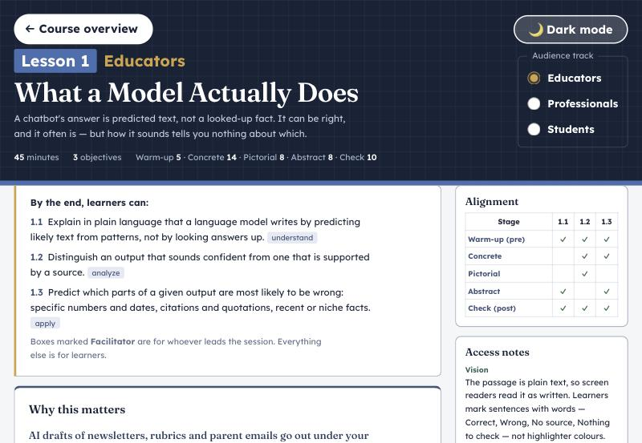 | 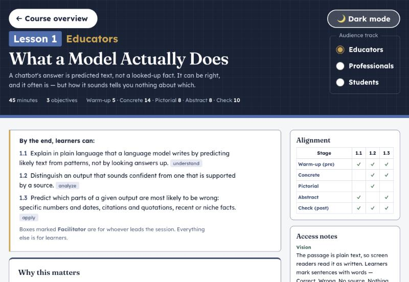 |

- **Principle:** Hierarchy, from the Gestalt principles (Wertheimer, 1923).
  By proximity, content touching the header reads as part of it.
- **Usability goals (Nielsen):** learnability and satisfaction.
- **Who:** everyone, on every page, in both themes, at every width.
- **Severity:** low, but it's a bug, not a taste.
- **Effort:** two lines of CSS.
- **Tests touched:** none fail. The spacing test accepts 32px. I'd add one
  test that `main` has top padding, so this can't come back.
- **Rules check:** tokens only. Amber is a border, not text, so the text rules
  don't apply. In dark mode the amber rule is 9.24:1 against the page. In light
  mode it is 2.06:1 against the page but sits under a dark header, so the
  header's own edge shows the boundary (7.13:1). It is decorative there.
- **Baseline:** moves toward Singapore Math.

---

## 2. One box language

**What's wrong.** Inside one stage block there can be five box styles, and
dashed has three meanings. Two boxes break the outline rule from 2026-10-05:
the passage and facilitator boxes are 1px, and the lavender "Expect" box is
outlined in brown.

**Proposal.** Three kinds of box, each with one look:

| Kind | Look | Used for |
|---|---|---|
| Stage | Card, `--edge` outline, coloured top band, as now | Every stage block |
| Learner material | Card surface, 1.5px `--edge` outline, solid | The passage, the chat, the inbox |
| Note | Pale fill, 1.5px outline in its own colour, 4px left rule in the same colour | Facilitator notes (`--ink-3`), Watch for (`--prop`), Expect and Reteach (`--peri`) |

Dashed is kept for one meaning only: a lesson still in design.

```css
.passage{background:var(--card);border:1.5px solid var(--edge);border-radius:var(--r-md)}
.facil{background:var(--paper);border:1.5px solid var(--edge);border-left:4px solid var(--ink-3);border-radius:0 var(--r-lg) var(--r-lg) 0}
.watch,.expect,.crit{border-left-width:4px;border-radius:0 var(--r-md) var(--r-md) 0}
.expect,.crit{border-color:var(--peri)}
```

| Before | After |
|---|---|
| 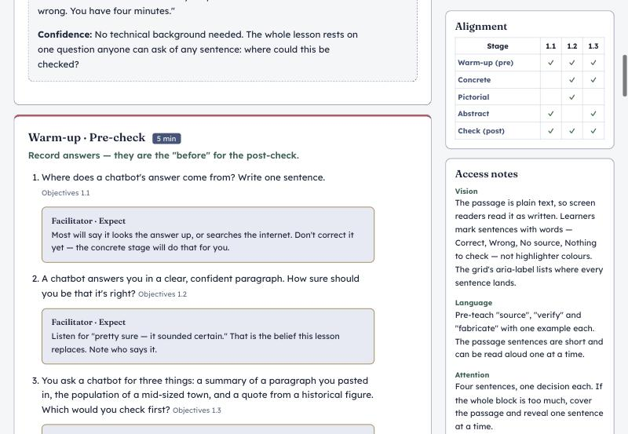 | 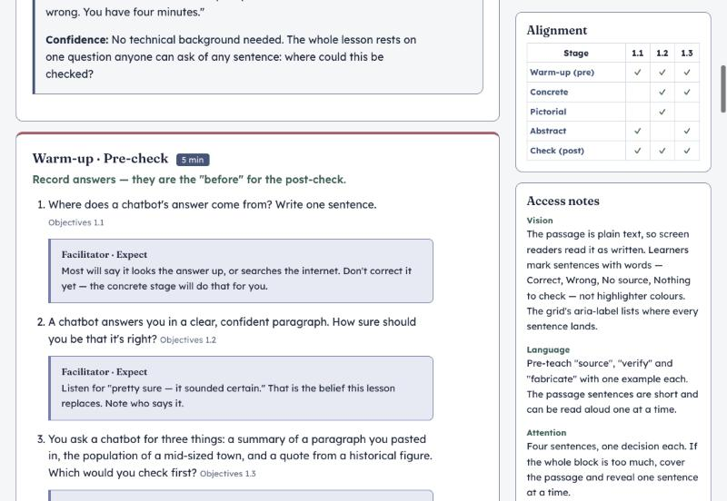 |

- **Principle:** Consistency, from Shneiderman, "strive for consistency", and
  Nielsen (1994), "consistency and standards". One look per meaning.
- **Usability goals (Nielsen):** learnability and memorability. A facilitator
  learns once what a note looks like.
- **Who:** everyone on a lesson page. All twelve lessons and Essentials 1 use
  these boxes.
- **Severity:** medium. The noise is on every lesson, and two boxes break a
  rule you set.
- **Effort:** about fifteen lines of CSS. No renderer changes.
- **Tests touched:** the box-outline test in `tests/ui.test.js` should list
  `.passage` and `.facil`, and accept `--peri` and `--ink-3`. Both pass 3:1:
  `--peri` is 3.95:1 on a card in light and 6.25:1 in dark, and `--ink-3` is
  7.11:1 and 7.99:1 on the page. I'd add one test that only `.card.pending`
  uses a dashed border.
- **Rules check:** "Facilitator and learner content are kept apart" still
  holds. The facilitator box keeps its heading and gets its own left rule and
  surface. All text pairings are already in `PAIRS`.
- **Baseline:** Singapore Math uses solid boxes, and a solid left rule on its
  objective box, with no dashed boxes in a lesson, so this moves toward it.

---

## 3. A compact header on phones — **Your call**

**What's wrong.** At 320px the lesson header is 727px tall on a 640px screen.
The learner scrolls past a full screen of header before the lesson starts. At
375px it is 591px. The stage timings line repeats the minutes shown on each
stage block.

**Proposal,** at 560px and narrower only (desktop is unchanged):

- header pills at `--fs-sm` with 12px side padding, so each fits on one line;
- the "Lesson N · Track" line at `--fs-lg` instead of `--fs-xl`;
- the stage timings hidden; each stage block already shows its minutes;
- the track picker as a segmented control: the same three radio buttons, shown
  as pills, with a tick and a filled pill on the chosen one (not colour alone);
- **the theme toggle says "Dark" / "Light" instead of "Dark mode" / "Light mode"**,
  as Singapore Math does. Without this, the two pills don't fit side by side at
  320px. My first sketch kept the longer words and scrolled sideways (348px).

```css
@media (max-width:560px){
  .top{padding:16px 0 12px}
  .top a.back,.theme-toggle{font-size:var(--fs-sm);padding:8px 12px;white-space:nowrap}
  .top .eyebrow{font-size:var(--fs-lg)}
  .top[data-lesson] .facts > span:nth-child(3){display:none} /* better: a class from the renderer */
  .tracks{display:flex;flex-wrap:wrap;width:100%;border:0;padding:4px;
    background:rgba(255,255,255,.08);border-radius:var(--r-lg)}
  .tracks label{flex:1 1 auto;justify-content:center;font-size:var(--fs-sm);
    border-radius:var(--r-pill);padding:4px 8px;gap:4px;min-height:44px}
  .tracks input{position:absolute;width:1px;height:1px;margin:0;overflow:hidden;clip:rect(0 0 0 0)}
  .tracks label:has(input:checked){background:var(--on-dark);color:var(--pill-text)}
  .tracks label:has(input:checked)::before{content:"✓"}
  .tracks label:has(input:focus-visible){outline:3px solid var(--focus);outline-offset:2px}
}
```

| Before (320px, 727px header) | After (320px, 539px header) |
|---|---|
| 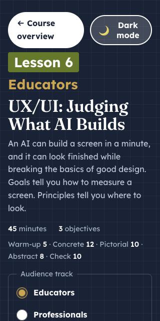 | 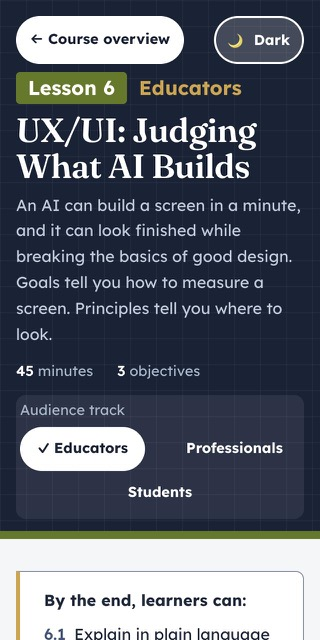 |

Measured with the sketch: the Lesson 6 header goes from 727px to 539px at 320px
(26% shorter), with no sideways scroll at 320px or 375px.

- **Principle:** Usability, from Nielsen, *Usability Engineering* (1993): ask
  only for what's needed now. Also Context: the learner sees the lesson begin.
- **Usability goals (Nielsen):** efficiency, and satisfaction on a small screen.
- **Who:** everyone on a phone, on every lesson page and the hub. That is most
  likely the Students track.
- **Severity:** medium to high on phones; none on desktop.
- **Effort:** 1–2 hours: CSS, a class on the timings span in `lesson-core.js`,
  the toggle labels in `theme-toggle.js` and the three HTML pages, then
  `npm run csp` if any page script changes.
- **Tests touched:** the theme-toggle tests expect "Dark mode" and "Light mode"
  and would change to "Dark" and "Light". Tap targets stay 44px. The radios are
  hidden with `clip`, not `opacity`, so the no-fade test passes. The render
  tests switch tracks through the radios, which are unchanged.
- **Rules check:** the theme toggle still has no `aria-label`; its visible word
  is its name (WCAG 2.5.3). Focus shows on the pill around a focused radio.
  Arrow keys still move between radios. `--pill-text` on `--on-dark` and
  `--on-dark` on the header are existing pairs. The `rgba` tint is the same
  kind the header already uses for the toggle.
- **Your call:**
  1. "Dark" / "Light" instead of "Dark mode" / "Light mode". It matches the
     baseline, but it changes wording you approved.
  2. If you'd rather keep "Dark mode", the fallback is to let the pills sit on
     two rows below 360px. That saves less: the header would be about 600px.

---

## 4. Calmer hub cards — **Your call**

**What's wrong.** A card's job on the hub is to help someone pick a lesson.
Today each card also lists every objective with its Bloom level, so at 320px
each card is taller than the screen and the hub is 15,937px long. The cards
also have the heaviest frame on the site (2px outline plus an 8px top band),
which is thicker than the 1.5px box rule, and every title is underlined at rest.

**Proposal.**

- The card shows the badge, title, framing sentence and a meta line:
  "3 objectives · 45 minutes".
- The objectives move off the hub. They are the first thing on every lesson
  page, and search still finds them.
- The frame becomes the standard box: a 1.5px outline in the lesson colour and
  a 4px top band.
- Titles are underlined on hover and focus, not at rest. The whole card is the
  link, and hover outlines the card, as now.
- On hover, a 2px lift and a soft shadow, only when motion is allowed (item 5).

| Before | After |
|---|---|
| 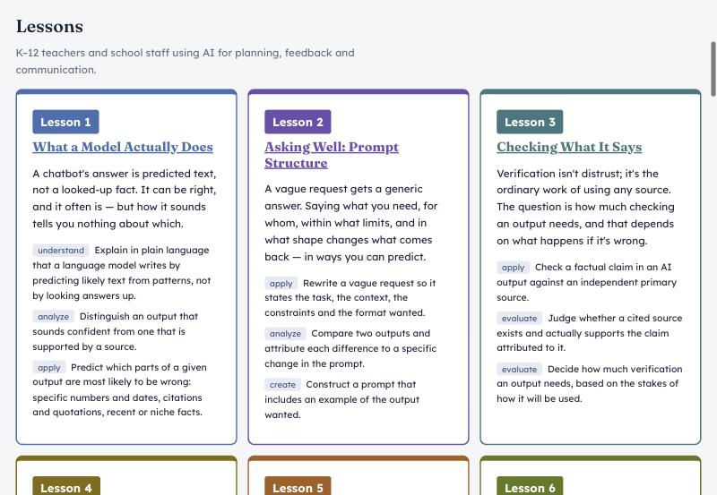 | 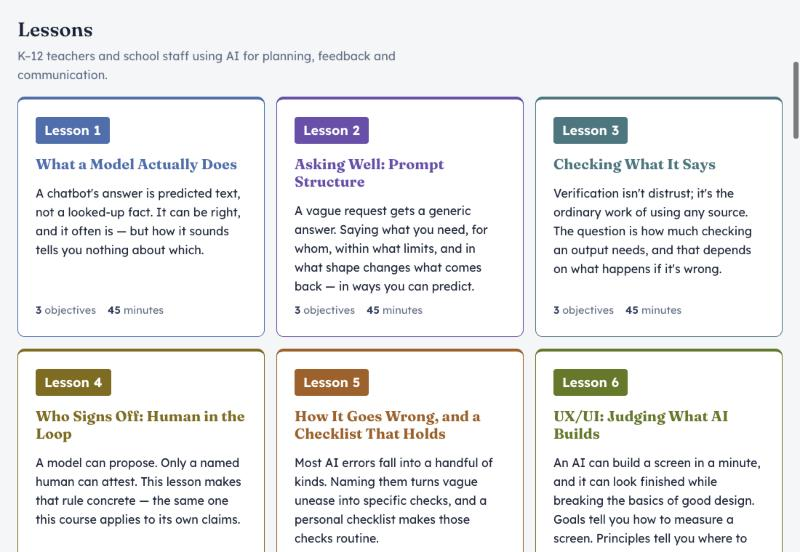 |
| 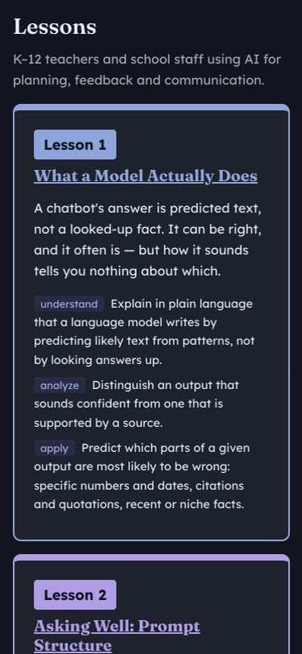 | 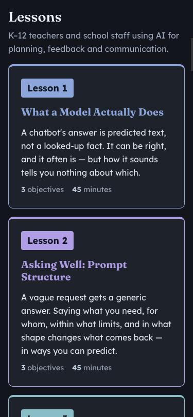 |

Measured with the sketch at 320px: cards go from 595–822px to 331–435px tall,
and the hub from 15,937px to 11,970px (25% shorter).

- **Principle:** Hierarchy, from the Gestalt principles: remove what doesn't
  earn its place at this step. Also Usability: one decision per view.
- **Usability goals (Nielsen):** efficiency and learnability. A newcomer sees
  thirteen choices, not thirty-nine objectives.
- **Who:** everyone who opens the hub, on every device.
- **Severity:** medium. The hub is the front door.
- **Effort:** 1–2 hours. The card template in `lesson-core.js` (the `card`
  function) and about ten lines of CSS.
- **Tests touched:** the render test that counts cards and their links still
  passes. I'd add `.card` to the box-outline test, since it would now follow
  the 1.5px rule. No readability ceiling changes.
- **Rules check:** `--muted` and `--ink-2` on `--card` are existing pairs
  (5.04:1 light, 6.50:1 dark for `--muted`). The shadow uses `rgba`, not hex,
  and only adds depth: the card's outline still shows its shape at 3:1.
- **Your call:** the hub shows the course's backward design today; each card
  leads with what learners will be able to do. If that matters for educators
  choosing a lesson, a middle way is a closed "3 objectives" disclosure on the
  card. It needs `position:relative; z-index:1` so the card's stretched link
  doesn't cover it, and a 44px summary like the others.

---

## 5. Reveal controls that look like controls, and quiet motion

**What's wrong.** Under each passage sentence, "▸ Reveal" is small grey text. It
works and is 44px tall to tap, but it doesn't look like something to press
(Norman's signifiers). The site has almost no motion: a reveal snaps open with
nothing to show what changed.

**Proposal.**

- Each answer-key summary becomes a quiet outlined pill: `--edge` outline,
  `--ink-2` text, a paper fill on hover and when open. Still 44px tall.
- When a key opens, its content slides in 4px over 180ms.
- Hub cards lift 2px on hover over 150ms (item 4).
- Nothing moves on its own, nothing loops, and everything stops under
  `prefers-reduced-motion`. The existing global rule already turns off all
  animation and transition there.

```css
.key summary{display:inline-flex;align-items:center;gap:4px;font-size:var(--fs-sm);
  color:var(--ink-2);border:1.5px solid var(--edge);border-radius:var(--r-pill);
  padding:0 16px 0 12px;margin:4px 0;background:var(--card)}
.key summary:hover,.key[open] summary{background:var(--paper)}
@media (prefers-reduced-motion:no-preference){
  .key[open] > :not(summary){animation:reveal .18s ease-out}
  @keyframes reveal{from{transform:translateY(-4px)}to{transform:none}}
}
```

| Before | After |
|---|---|
| 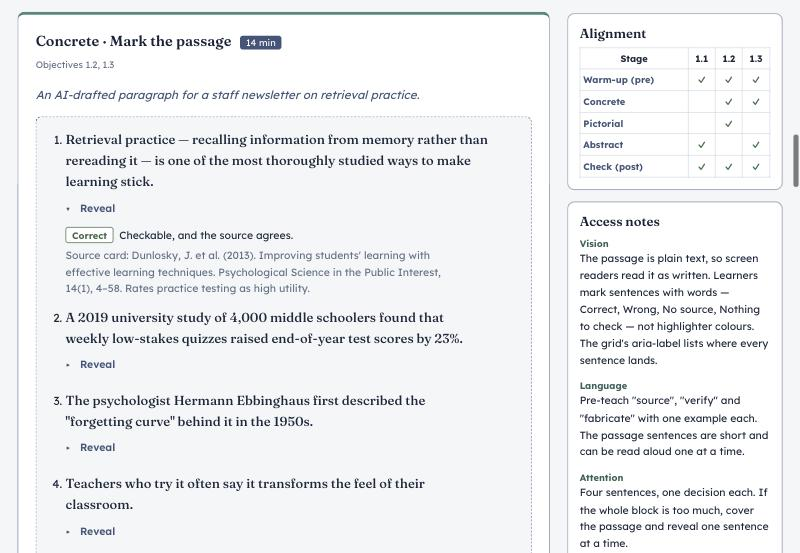 | 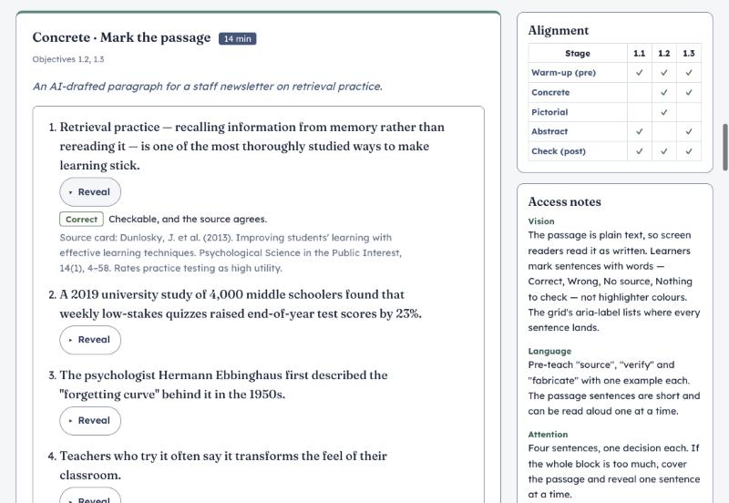 |

- **Principle:** Context, from Norman, *The Design of Everyday Things*
  (feedback and visibility), and Nielsen (1994), "visibility of system status".
  The motion follows Wellbeing (value sensitive design, Friedman, 1996): it
  answers what the learner did and never pulls at their attention.
- **Usability goals (Nielsen):** learnability (people see what to press) and
  satisfaction.
- **Who:** everyone doing a concrete exercise, in every lesson.
- **Severity:** low to medium.
- **Effort:** about fifteen lines of CSS.
- **Tests touched:** none fail. `.key summary` keeps `min-height:44px`; the
  drawn arrow stays; the reduced-motion test passes.
- **Rules check:** `--ink-2` on `--card` and `--paper` are existing pairs. The
  `--edge` outline is 3.33:1 on a card in light and 3.32:1 in dark. Motion is
  180ms or less, so it doesn't slow anyone down.
- **Note:** a pill a full 44px tall is quite large under every sentence, as
  the "after" image shows. A 32px pill with a 44px tap area would look lighter
  but needs a `<span>` inside each summary, which is a small renderer change.

---

## Not proposed, and why

- **Removing the graph-paper header texture.** It can look dated, but it's the
  Singapore Math baseline's signature. Change it in both sites or neither.
- **Shadows on every card.** In dark mode shadows barely show, so depth would
  differ between themes. Outlines carry shape in both; shadows only on hover.
- **Gradients, glass effects, a new font.** They add weight without helping
  anyone finish a task, and a new font means another self-hosted file.
- **A sticky header.** It would take a strip of every phone screen for good.
- **Page-transition animation when switching tracks.** It needs the View
  Transitions API in `lesson-core.js`. Worth a look after item 5 if the
  quiet motion works out.

## Noticed along the way (outside the visual refresh)

- **Search help repeats its label.** The label says "Search lessons, objectives,
  stages and claims" and the hint below says "Search every lesson, objective,
  stage and claim." One is enough. (User-centricity; low; everyone on the hub.)
- **"Clear search" is the only filled button on the hub**, and it shows while
  the search box is empty. The strongest-looking action is the one that does
  nothing yet. It could stay hidden until there's something to clear.
  (Hierarchy; low; everyone on the hub.)
- **"Reveal" doesn't change to "Hide" when open.** `CLAUDE.md` asks reveal
  buttons to toggle "Show…" / "Hide…". These are disclosures, not buttons, and
  the arrow does flip, so this may be fine. Your call whether the rule covers
  them. (Context; low.)

## Checked against the UX standard

For every item: tokens only, no hex outside the token blocks; both themes;
every text pairing already in `PAIRS`; outlines 3:1; the type scale (no new
sizes); the spacing scale (0–48px); the radius tokens; 44px targets; visible
focus; colour never the only cue (the chosen track has a tick, keys keep their
words); no sideways scroll at 320px and 375px (measured for items 3 and 4);
reduced motion respected; no new third-party requests; no addictive patterns.
None of these screens show AI output, so the Human–AI checklist doesn't apply.

## If you approve items

Each item would be its own commit, with its tests, and checked in the preview
in both themes and at 320px and 375px before it's called done. Item 1 is a good
first step: it's small, it fixes a bug, and every other item looks better with
it in place.
